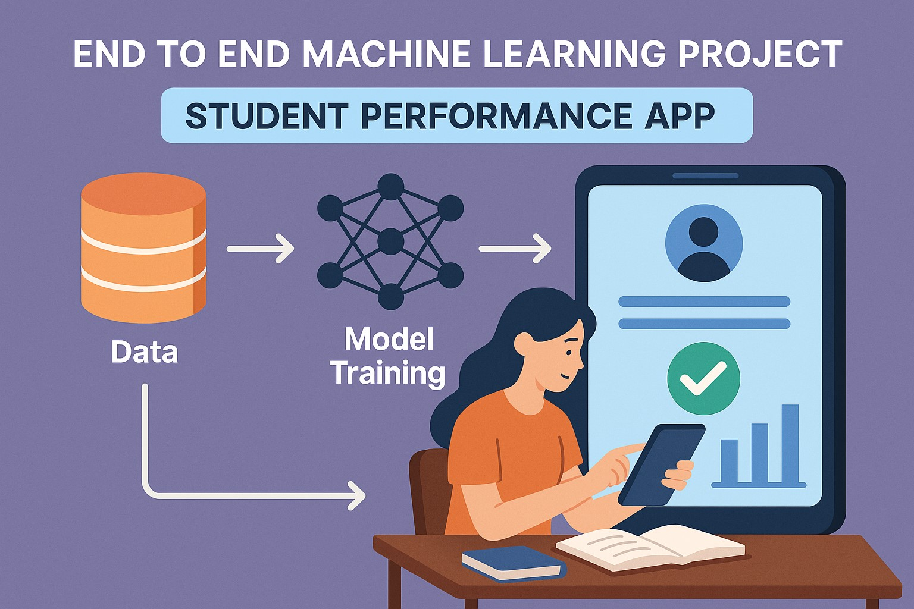

# 🎓 Student Performance Prediction App

## 🔍 Brief Description
This project demonstrates the end-to-end lifecycle of a machine learning application — from data preprocessing and model training to deployment via a Flask-based web interface. The app allows users to input student details through a simple UI and returns a performance prediction (likely a score or category).

## 🚀 Project Overview

- 🧠 **Machine Learning Model**: Predict student performance levels from input features like gender, race, parental education level, lunch type, and test preparation course using ML algorithms. Various ML algorithms are trained to make predictions based on preprocessed data and selected the one with highest r2 score.

- 🛠 **Data Pipeline**: Includes data preprocessing, EDA, model training, and evaluation in Jupyter Notebooks.

- 🌐 **Flask Web App**: A simple UI for users to enter student details and receive predictions instantly.

- 🐳 **Dockerized**: Easily deployable using Docker, with support for cloud deployment (e.g., AWS Elastic Beanstalk).

- ⚙️ **CI/CD Ready**: GitHub Actions configured for build and deployment automation.

## 🔧 Key Components
|Component|	Description|
|---------|------------|
|app.py|	Flask server handling model loading, user input, and prediction|
|templates/|	HTML templates for rendering the frontend|
|notebook/|	Jupyter notebooks for data analysis and model building|
|artifacts/|	Stores trained model and encoders for use during inference|
|.github/workflows/|	Contains GitHub Actions config for CI/CD pipeline|
|Dockerfile|	Used to containerize the app for easier deployment|
|.ebextensions/|	Configuration for deploying the app on AWS Elastic Beanstalk|

## 📊 Student Performance App Workflow

### 1. Data Collection & Preprocessing

- **Source**: Raw student performance data is collected and stored in the "`notebook/`" directory.

- **Processing**: Data cleaning, feature engineering, and exploratory data analysis are performed using `Jupyter Notebooks`.

### 2. Model Training

- **Algorithm**: All the regression algorithms were tested and the one with highest r2 score is selected. The algorithm with highest r2 score is trained on the preprocessed data.

- **Artifacts**: Trained model artifacts are saved in the "`artifacts/`" directory for later use.

### 3. Application Backend

- **Framework**: The backend is developed using `Flask`.

- **Functionality**: Handles HTTP requests, loads the trained model, and processes user inputs to generate predictions.

### 4. Frontend Interface

- **Templates**: HTML templates(home.html and index.html) located in the "templates/" directory provide the user interface.

- **User Interaction**: Users input data through web forms, which are then sent to the backend for prediction.

### 5. Deployment

- **Containerization**: The application is containerized using `Docker`.

- **Cloud Deployment**: The application is deployed on `AWS Elastic Beanstalk`.

### 6. Automation & CI/CD Using GitHub Actions

- **GitHub Actions**: Workflows defined in "`.github/workflows/`" automate tasks such as testing, building, and deploying the application.

## 📁 Project Structure

## 🧪 How to Run Locally

### Clone the repo
`git clone https://github.com/anulsasidharan/Student_Performance_App`

`cd Student_Performance_App`

### Create virtual environment
`conda create -p venv python==3.12`

`conda activate venv/`

### Install dependencies
`pip install -r requirements.txt`

### Run the app
`python app.py`
